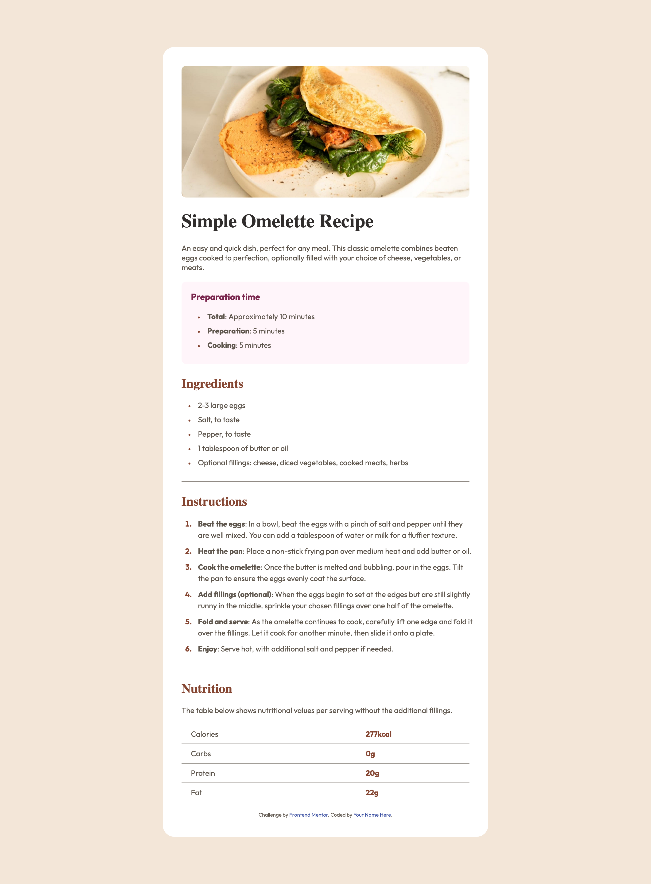

# Frontend Mentor - Recipe page solution

This is a solution to the [Recipe page challenge on Frontend Mentor](https://www.frontendmentor.io/challenges/recipe-page-KiTsR8QQKm). Frontend Mentor challenges help you improve your coding skills by building realistic projects.

## Table of contents

- [Overview](#overview)
  - [The challenge](#the-challenge)
  - [Screenshot](#screenshot)
  - [Links](#links)
- [My process](#my-process)
  - [Built with](#built-with)
  - [What I learned](#what-i-learned)
  - [Continued development](#continued-development)
- [Author](#author)

**Note: Delete this note and update the table of contents based on what sections you keep.**

## Overview

### Screenshot

### Links

- Live Site URL: [Add live site URL here](https://your-live-site-url.com)

## My process

Write a piece, test, pray, continue...

### Built with

- Semantic HTML5 markup
- Responsive Design

### What I learned

I learned how to style lists better. I learned how to use media queries with a breakpoint in practice not just in theory-land.

### Continued development

I couldn't style the `1` in the `ol` to be sans serif with the provided font. I have to fix that when I feel like spending two hours on google. I want to better organize my CSS code because now it is just lightly following the page structure.

## Author

Jon Avila

- Frontend Mentor - [@madroosterlab](https://www.frontendmentor.io/profile/madroosterlab)
- Twitter - [@madroosterlab](https://www.x.com/madroosterlab)
